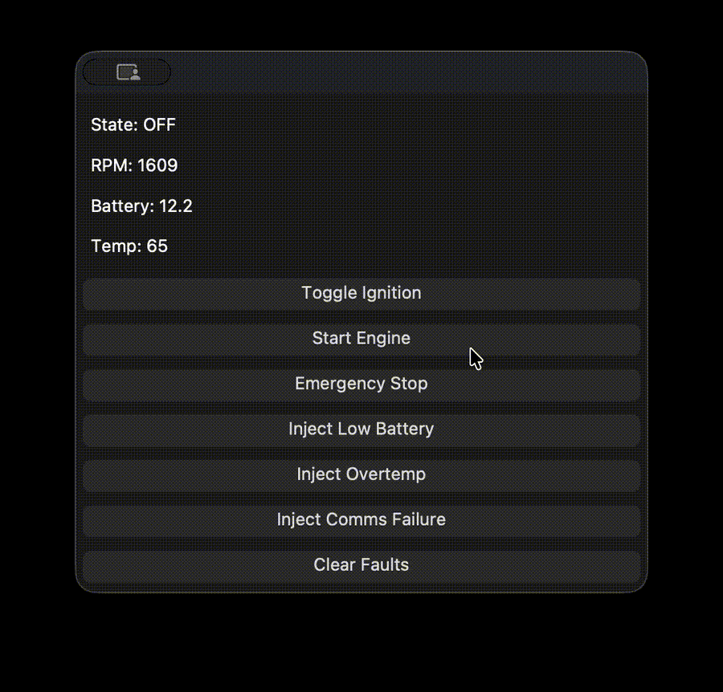
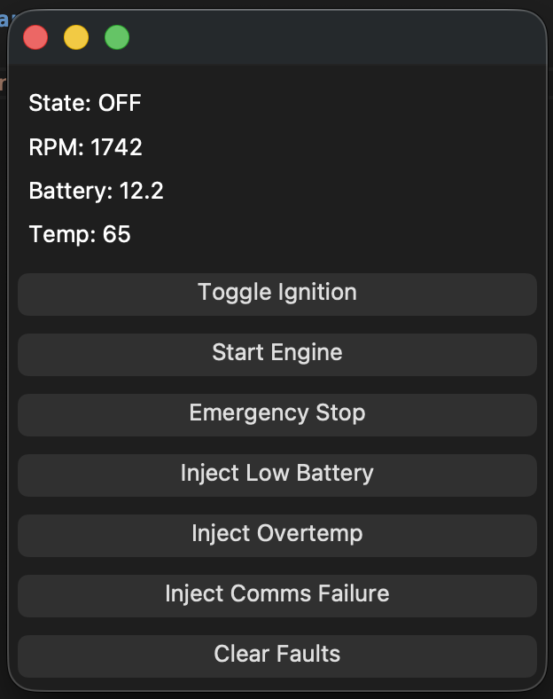

# Embedded ECS Simulator



A **C++17-based simulation of an industrial vehicle Electronic Control System (ECS)** designed to demonstrate common embedded software architecture used in automotive and heavy equipment systems.

This project simulates a simplified **vehicle ECU (Electronic Control Unit)** including system state management, diagnostics, CAN-style messaging, and an operator dashboard.

The simulator is intended as a **demonstration of embedded systems design principles** rather than a full vehicle model.

---

# System Overview

The simulator models a simplified vehicle control system with the following components:

```mermaid
flowchart TD

    A[Qt Operator Dashboard] --> B[Controller]

    B --> C[Sensor Manager]
    C --> D[Diagnostics Manager]
    D --> E[State Machine]
    E --> F[CAN Interface]

    F --> G[CAN Message Output]

The system runs in a continuous control loop similar to real embedded vehicle controllers.

---

# Features

### Embedded Control Loop

A real-time control loop updates system state, evaluates diagnostics, and transmits CAN-style messages.

### Finite State Machine

The ECS state machine models typical vehicle operating states:
OFF
BOOT
IDLE
RUNNING
WARNING
FAULT
EMERGENCY STOP


State transitions occur based on sensor inputs, operator commands, and diagnostics.

### Sensor Simulation

The system simulates common vehicle telemetry:

- Engine RPM
- Battery voltage
- Oil temperature
- Hydraulic pressure
- Vehicle speed
- Communication status

### Diagnostics System

A diagnostics engine monitors system conditions and detects faults such as:

- Low battery voltage
- Overtemperature
- Communication failures

Faults trigger warnings, fault states, and simulated CAN messages.

### CAN Communication Simulation

The system simulates transmission of CAN-style messages including:

- System state
- Sensor telemetry
- Active fault codes

### Qt Operator Dashboard

A graphical interface allows interaction with the simulated ECS.

The dashboard provides:

- Real-time telemetry display
- System state visualization
- Operator control inputs
- Fault injection tools

### Fault Injection

Faults can be injected to test system behaviour:

- Low Battery
- Overtemperature
- Communication Failure

This allows testing of diagnostics and system recovery logic.

---

# Technologies Used

- **C++17**
- **Qt5** (GUI Dashboard)
- **CMake** (build system)
- **Multithreading**
- Modular embedded architecture

---

# Project Structure
vehicle-ecs-simulator
│
├── include/ # Header files
│
├── src/ # Core ECS implementation
│
├── qt_dashboard/ # Qt GUI dashboard
│
├── build/ # Build output (ignored by git)
│
├── CMakeLists.txt
└── README.md


---

# Build Instructions

Requirements:

- CMake
- Qt5
- C++17 compatible compiler

Build:
mkdir build
cd build
cmake ..
make


Run:
./vehicle_ecs_simulator


---

# Example System Behaviour

Typical operation flow:
OFF
↓ ignition
BOOT
↓
IDLE
↓ start
RUNNING


Fault example:
RUNNING
↓ overtemperature
FAULT


Emergency stop example:
RUNNING
↓ emergency stop
EMERGENCY STOP


---

# Purpose of This Project

This project demonstrates fundamental embedded systems concepts commonly used in:

- vehicle electronics
- industrial machinery
- control systems
- robotics platforms

It illustrates how software components such as **state machines, diagnostics engines, and communication interfaces** interact in an embedded system.

---

# Future Improvements

Possible extensions include:

- CAN bus monitor window
- Graphical gauges for telemetry
- J1939-style message formatting
- Logging and playback of system events
- Hardware-in-the-loop testing support

---

# License

This project is intended for educational and demonstration purposes.

## Dashboard

